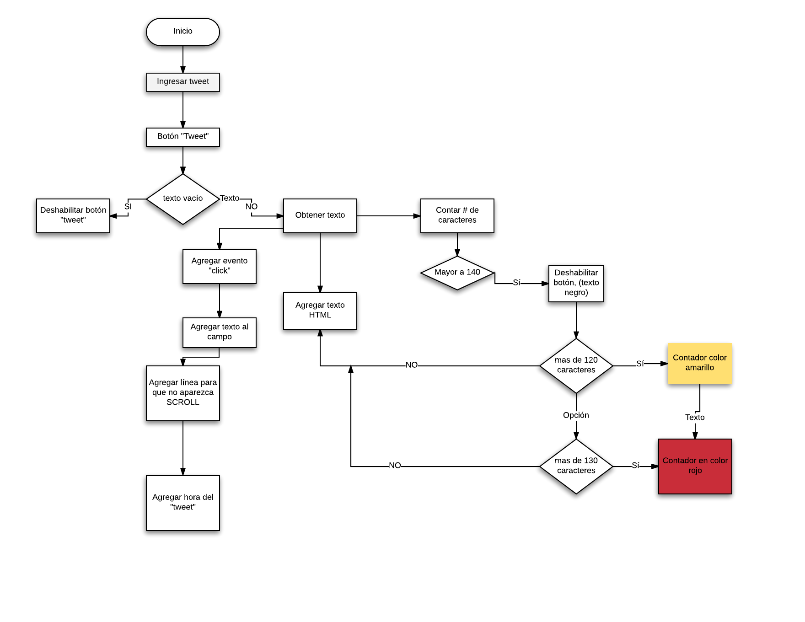

# Twitter

* **Curso:** _Haciendo tu sitio web interactivo_
* **Unidad:** _Creando interaccion con Javascrip_

***
## Objetivo

Replicar el newsfeed de **Twitter** con diferentes versiones.

***

Para completar este reto trabajamos en colaboracion por squad para crear una replica de la web "Twitter" donde a travès de funciones creadas en DOM, podamos emitir un "tweet". El reto debe quedar de la siguiente manera:


## Flujo de trabajo

1. Crear el maquetado de las carpetas
 1.0 Assets
  1.1 Images (guardaremos todas las imagenes que usaremos en nuestra web)
 1.2 CSS
  1.1 css (donde guardaremos nuestro estilo de pagina web)
 1.3 JS
  1.1 js (guarda nuestro codigo escrito en Javascrip)
 1.4 index.html (guarda nuestro codigo escrito en html)
 1.5 README.md (flujo de nuestra pagina web)

2. Crear un repositorio local.

3. Subir nuestro respositorio local a GitHub

4. Crear diagrama flujo.

5. Maquetar, dar funciones y estilo a nuestra pagina web con diferentes versiones.


## Consideraciones
```
* Version 0.0.1
```
- Diseñar formulario para ingresar texto y el boton que permita "twittear"
- Agregar evento "click" al boton al formulario
- Obtener el texto del evento
- Agregar el texto a nuestro HTML

```
* Version 0.0.2
```
- Si el usuario no ingresa texto deshabilitar el boton "twittear".
- Ir contando los caracteres de forma regresiva.

```
* Version 0.0.3
```

- Si el tweet rebasa los 140 caracteres, deshabilitar el boton.
- Si rebasa los 120 caracteres, mostrar el contador de color amarillo
- Si rebasa los 130 caracteres, mostrar el contador de color rojo.
- Si rebasa de los 140 caracteres, mostrar el contador en negativo y color negro.

```
* Version 0.0.4
```

- Al presionar enter debera crecer el texarea de acuerdo al texto ingresado por el usuario

```
* Version 0.0.5 (Extra)
```

- Si la cantidad de caracteres es mayor al textarea, debe agregarse una línea más debajo para no aparecer la barra de scroll.

```
* Version 0.0.6 (Extra)
```
- Agregar la hora en la que se publico el tweet. Formato en 24 hrs.

> Nota: No detenerse demasiado tiempo en el diseño de la pagina, es decir, fuentes y colores.

##Diagrama de flujo


